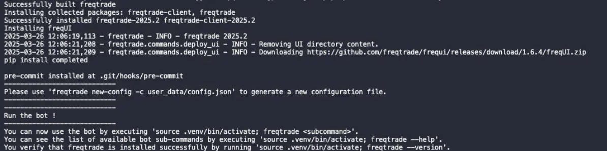
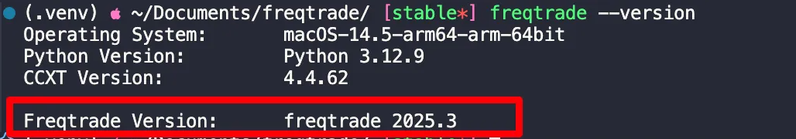

# 部署手册
官方手册

[https://www.freqtrade.io/en/stable/installation/](https://www.freqtrade.io/en/stable/installation/)

Mac手动部署, 可参考MACOS官方部署文档如下👇

[https://www.freqtrade.io/en/stable/installation/#__tabbed_1_2](https://www.freqtrade.io/en/stable/installation/#__tabbed_1_2)

## 详细部署步骤
### 1. 克隆仓库、切换稳定分支(stable)
```bash
# Download `develop` branch of freqtrade repository
git clone https://github.com/freqtrade/freqtrade.git

# Enter downloaded directory
cd freqtrade

# your choice (1): novice user
git checkout stable

# your choice (2): advanced user
git checkout develop
```

### 2. 安装TA-Lib (install instructions below) 【建议按下面的命令手动安装】
```bash
wget http://prdownloads.sourceforge.net/ta-lib/ta-lib-0.4.0-src.tar.gz

tar xvzf ta-lib-0.4.0-src.tar.gz

cd ta-lib

sed -i.bak "s|0.00000001|0.000000000000000001 |g" src/ta_func/ta_utility.h
./configure --prefix=/usr/local

make

sudo make install
# On debian based systems (debian, ubuntu, ...) - updating ldconfig might be necessary.
sudo ldconfig  

cd ..

rm -rf ./ta-lib*
```

### 3. 创建虚拟环境（务必检查bin文件夹等是否齐全）
```bash
# create virtualenv in directory /freqtrade/.venv
python3 -m venv .venv

# run virtualenv
source .venv/bin/activate
```
### 4. 安装依赖
```bash
python3 -m pip install --upgrade pip
python3 -m pip install -r requirements.txt
```
### 5. Install
```bash
# install freqtrade
python3 -m pip install -e .
```
安装成功后显示👇


查看版本👇
```bash
freqtrade --version  
```
                          
